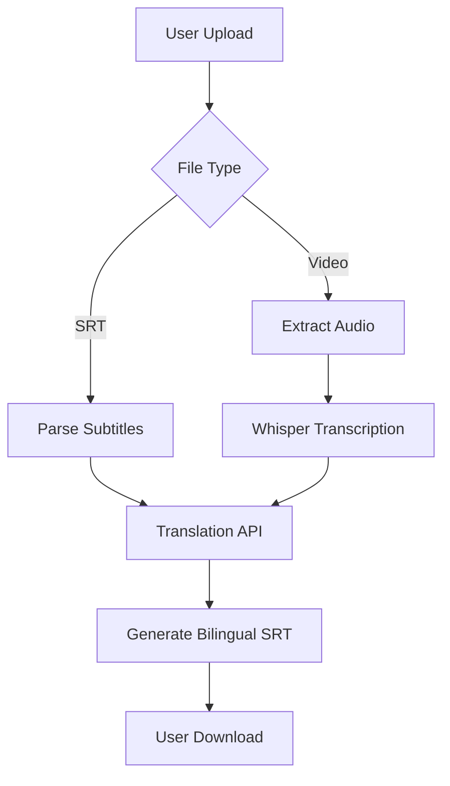

# Bilingual Subtitle Generator

[](https://www.python.org/)
[](https://flask.palletsprojects.com/)
[](https://openai.com/research/whisper)

A web application for generating bilingual subtitles from video files or translating existing SRT subtitles. Powered by OpenAI's Whisper for speech recognition and custom translation API.

[English](./README.md) | [简体中文](./README-ZN.md)| 繁體中文 | 日本語 | 한국어<br>
## Features

- 🎥 Video to Bilingual Subtitles
- 🔊 Automatic Audio Extraction
- 🌍 Multi-language Translation (CN/EN/ES/FR/DE/JA/KO/other)
- ⏳ Real-time Progress Tracking
- 📄 SRT File Translation
- 📁 Batch Processing Support

## Installation

### Prerequisites
- Python 3.8+
- NVIDIA GPU (Recommended)
- FFmpeg (for audio processing)

```bash
# Clone repository
git clone https://github.com/sakmist/bilingual-subtitle-generator.git
cd bilingual-subtitle-generator

# Install dependencies
pip install -r requirements.txt

# Create uploads directory
mkdir uploads
```

## Usage

### 1. Start the Server
```bash
python app.py
```

### 2. Access Web Interface
Open `http://localhost:5000` in your browser

### 3. Process Files
- **For Videos**:
  1. Upload video file (MP4/AVI/MOV)
  2. Select target language
  3. Download generated SRT

- **For Subtitles**:
  1. Upload existing SRT file
  2. Select target language
  3. Download translated SRT


## Configuration

Modify `app.py` for custom settings:
```python
# Whisper Configuration
model = whisper.load_model("medium", device="cuda:1")  # Change device as needed

# Translation API Endpoint
'http://your-translation-server/v1/chat/completions'  # Replace with your endpoint
like openai
```

## Technical Details

### Architecture


### Supported Formats
| Type       | Formats                   |
|------------|---------------------------|
| Video      | MP4, AVI, MOV, MKV        |
| Audio      | WAV (auto-generated)      |
| Subtitles  | SRT                       |

## Troubleshooting

**Q: Model download fails**  
A: Manually download Whisper models to `~/.cache/whisper`

**Q: Translation service unavailable**  
A: Ensure your translation API endpoint is running and accessible

**Q: GPU out of memory**  
A: Try smaller Whisper model (`base` instead of `medium`)

## License

MIT License. See [LICENSE](LICENSE) for details.

## Contributing

Contributions welcome! Please follow these steps:
1. Fork the repository
2. Create your feature branch
3. Commit your changes
4. Push to the branch
5. Open a Pull Request

---

**Note**: This project requires a separate translation service for full functionality. The demo implementation uses a custom API endpoint that should be replaced with your preferred translation service.
